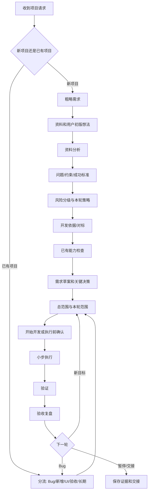

# Allred Project Standard Skill

当前 GitHub 预发布版本：`0.8.0-rc6`；最新稳定版仍为 `0.7.1`。安装目录中的 `VERSION` 和安装回执用于确认实验机实际加载的版本。

`allred-project-standard` 是一个 Codex 项目推进 Skill。它帮助用户把粗略想法变成可验证的本轮工作，同时避免两个极端：

```text
连续追问太多 <- Allred -> 全程不交流、Codex 自己决定
```

它适用于 App、脚本、自动化、数据整理、培训、制度、知识库、标书、合同、检验记录、设备相关分析、长期任务，以及 Skill/工作流优化，不只适合新建软件。

核心流程：

```text
路由定界 -> 读取证据 -> 内部方案 -> 必要决策 -> 连续执行 -> 新鲜验证 -> 交付沉淀
```

`0.7.0` 在自适应集中访谈上增加三项约束：用灰区地图让用户选择讨论范围；用 `Q` 区分当前事实、用 `D` 区分未来业务决定；把每项已批准决定映射到实现目标和验收证据。问题数量仍不设固定上限，重点是依赖顺序、信息覆盖、用户控制和等待体验。

`0.7.1` 修复 Windows 干净克隆后 CRLF 行尾导致执行记录校验器误判的问题，并把 CRLF 有效样例加入结构回归检查。

`0.8.0-rc3` 引入决策树/frontier 访谈模型：显式 `grill-me`/`grilling` 可拥有可见访谈，Allred 保留无外部 Skill 时的 frontier 降级实现，并在访谈后负责范围、执行和验收交接。`find-skills` 增加本地能力缺口门，搜索不再等于安装。动态 A/B/C、双轮乱序盲审、软件/培训/长期任务回归，以及三种可选 Skill 安装组合均已测试。本候选可以单独运行；`find-skills` 和 `grilling` 都不是前置依赖，也不会被静默安装。GitHub 稳定版是否升级仍需单独执行发布授权和实验机复测。

`0.8.0-rc4` 针对隐式通用流程 Skill 覆盖 Allred 集中访谈的问题增加流程所有权仲裁。它保留 rc3 已验证的证据、来源、范围、写入和验收能力，只阻止未被用户明确调用的 brainstorming/规划流程把交互改成逐题询问、逐段审批或让普通用户选择技术框架。V106 验证真实流程冲突，V107 验证部分回复不会批准未回答项目；发布候选已通过两项新增动态回归和原有 V105 相邻回归。

`0.8.0-rc5` 增加可执行的 `INTAKE -> EVIDENCE -> DECISION -> READY -> EXECUTION` 内部阶段门。首轮只补齐使用目的、资料、用户初步想法和可观察结果；样例与基准只提供事实，不能替用户决定产品。`继续`、`按推荐` 和样例提交不再被当作开发授权，最终开始卡必须在只读技术预检和内部执行记录完成后出现。新增长链路、含糊继续、证据越权和完整需求直启回归，并保留调试、长期任务和培训等既有路径。

`0.8.0-rc6` 把 rc5 的关键规则落实为三个硬校验：阶段迁移、父子决策前沿和最终范围来源。内部状态会保存用户原话、复杂度驱动因素、证据方法、技术候选版本及差异、范围来源和精确授权；未通过校验时不能进入决策、展示最终开始范围或执行。用户仍可直接用自然语言回答，不要求填写 `Q1/D1`。只读预检完成且只剩推荐项时，推荐确认和开始授权合并为一次，不再重复卡片。

Allred 借鉴 Superpowers 中“先看上下文、先找根因、遇到真实阻塞就停、完成前重新验证”的工程纪律，但不依赖或自动调用 Superpowers，也不引入强制 brainstorming、TDD/Red-Green、逐段审批、逐任务提交、worktree 或批次等待。

## 安装

```powershell
git clone https://github.com/pray5233/allred-project-standard.git
cd allred-project-standard
.\install.ps1
```

安装后新开一个 Codex 任务。

核对安装版本：

```powershell
Get-Content "$env:USERPROFILE\.codex\skills\allred-project-standard\VERSION"
Get-Content "$env:USERPROFILE\.codex\skills\.allred-project-standard-installation.json"
```

回执始终记录版本和 `SKILL.md` 哈希；只有安装来源处于干净 Git 状态时才记录 `source_commit`，否则标记 `uncommitted-package`，避免把未提交内容错误归到旧提交。

## 异机实验

需要在另一台电脑验证安装、提问轮数、执行边界和调试效果时，按 [TESTING.md](TESTING.md) 执行。仓库自带的 `experiments/fixtures/order-report` 是隔离测试夹具，先复制再测试，不要在仓库原件上操作。

## 推荐入口

第一次做项目或不熟悉开发：

```text
allred新手项目
我想做一个 Excel 清单整理工具，主要给普通办公室员工使用。
```

也可以使用简短别名 `allred新手`。单独出现“新手员工”等普通描述不会触发新手模式。

标准新项目：

```text
allred新项目
我想做一个客户问题跟踪工具，已有历史表格和初步想法。
```

继续已有项目：

```text
继续项目
导入后有几行没有识别。
```

也可以直接使用阶段词：

```text
功能调试
新增功能
界面优化
本轮验收
```

长期任务：

```text
allred长期任务
这是一个长期数据稳定性分析任务，本轮想先整理最近日志并验证一个判断。
```

长期 Skill/流程优化：

```text
长期任务优化
扫描当前 Skill 的架构和内容，找出不合理的地方并重构。
```

非软件项目仍使用原有入口，不需要新增大量触发词：

```text
allred新项目
基于当前资料整理一套员工培训，交付讲义、练习和培训验收标准。
```

```text
allred新项目
对照模板审阅合同草案，保留签署原件，输出差异和人工复核清单。
```

Allred 会自动路由培训、制度、知识库、标书、合同或检验记录。此版本只提供通用流程，不创建 `allred-company-context`，也不包含公司私有模板、术语或审批规则。

培训项目不会因为发现大量现有讲义就自动进入完整体系设计。模糊请求会先说明“简版文档包、现有资料审计、完整培训体系”的差别，并确认员工必须学习的内容；`列出目录并生成文档` 只确认输出形态，不会自动授权 Codex 决定模块、首期不讲内容、课时、评分线或 Markdown/Word 格式。

## 新手模式

新手模式只改变沟通方式，不降低开发标准，也不代表项目一定简单。

它也不会因为用户选择了新手模式，就提前决定“先做一个小版本”。本轮是一次完成、先验证关键风险还是先补资料，要等资料、用户初版想法、来源风险和交付环境明确后再判断。

它会：

- 使用普通业务语言，不先问框架、数据库或命令
- 优先接收样例文件、截图、旧模板和用户已有想法
- 把当前已经能够回答的多个问题集中提出，后续只追问由答案或新证据产生的依赖项
- 给出推荐默认值，回复 `1` 可全部确认
- 假设使用者是普通办公电脑，但不会擅自决定交付形态
- 在较长检查和开发过程中说明正在查什么、为什么查
- 保留相同的验证、数据保护和写入边界

退出时说：

```text
退出新手模式，按标准流程继续。
```

项目和当前阶段会保留，不会重新开始。

## 项目流程

```text
1. 路由和边界
-> 2. 读取资料、代码和证据
-> 3. Codex 内部形成方案、对标和验证路径
-> 4. 只在必要时合并关键决策
-> 5. 在确认范围内连续执行
-> 6. 使用当前证据重新验证
-> 7. 交付、复盘；明确触发时再写记忆/笔记
```

这些是 Codex 的内部工作顺序，不是 7 轮提问：

- 非简单新项目：先集中收集足够信息；范围稳定后合并 `范围草案 + 开始开发`，不重复确认。
- 已有项目的明确、安全、局部修改：通常零确认，检查后直接修改和验证。
- 后续新增确认：只能由新的产品分歧、证据冲突，或安装、设备、上传、发布等高风险动作触发。
- 已批准的命名范围不会再确认第二次。

### 动态项目契约

Allred 不使用固定的项目问卷。Codex 会先从用户描述、资料、代码和环境中形成内部项目契约，包括目标、核心工作流、处理对象、输入输出、证据、交付、边界和验收；这些只是内部思考位置，不会逐项询问。

只有同时满足以下条件的事项才会交给用户决定：

- 两种选择会明显改变最终结果
- 当前资料和工程无法确定
- 这个决定属于用户，而不是技术实现细节
- 推迟会造成返工、错误证据或无效验收

Codex 会先给出有依据的推荐假设，用户只需批准或修改少数高影响项。用户中途改变一项决定时，Allred 保留未受影响内容，只重新检查依赖部分；开发前给出一份完整替代范围，不让用户自己拼接 V1、V2、V3。

项目契约会区分：

- `U`：用户已经明确提出
- `E`：文件、工具或环境证据，只证明事实和可行性
- `R`：Codex 推荐，但尚未批准
- `D`：用户已经批准
- `X`：暂缓、拒绝或不在本轮

证据 `E` 不能替用户授权功能，推荐 `R` 也不会自动进入开发范围。每张决策卡都会写清“回复 1 到底批准哪些内容”；只选择桌面交付，不会顺便批准自动保存或其他推荐。

这些字母主要用于 Codex 内部和项目记录。对新手显示时会使用“已确认、检查依据、推荐待批准、本轮不做”等普通文字。未批准且不影响核心目标的推荐会移到后续保留，不会为了状态完整继续追问；只有排除后导致目标无法完成、无法验证或不安全时才会阻塞。

推荐还必须通过必要性过滤：只有服务于已确认目标、解决已验证风险，或保证功能可测试、可运行、可恢复和安全时才进入批准包。“常见功能”“以后可能有用”“实现方便”都不是理由；没有要求的导出、筛选、定时和历史记录默认不建议。

`App`、`工具`、`系统` 不自动代表网页、桌面软件或本地 HTML。交付形态必须来自用户明确说明或已批准的项目契约；开发电脑能运行某种框架，只能证明技术可行，不能代替用户选择。

开始开发前还会分别列出：

- 开发期写入：代码、构建目录、锁文件和测试输出
- 运行期写入：设置、日志、缓存、本地数据库、导出和临时文件
- 外部或系统影响：依赖安装、网络服务、Git、上传、部署、设备或系统修改

每项承诺都有对应验收证据。构建通过不能代替启动、重启持久化、真实来源、打包或目标电脑验证。

确认卡只显示用户需要理解的内容：功能、使用方式、数据处理、重要限制、不做内容、验收和真正有影响的副作用。精确文件、命令、SDK、缓存、来源证据、回退和测试账本由 Codex 在执行前准备为内部执行记录，不要求普通用户阅读或批准。

执行记录不能隐藏新增功能或重要后果。安装软件、传输数据、写共享目录、上传、部署、设备/系统操作、费用或破坏性回退必须提升到确认卡，用普通语言说明。安全的只读资料、来源和环境检查通常先执行，再统一给出一张最终开发确认，不增加方向审批。

作为范围依据的文件、网址、接口、依赖和环境必须有可复现标识、版本/日期、实际输入或查询、观察结果、限制和缺口。覆盖矩阵每格只有一个当前状态，补充说明另列。

写出回退方案不代表预先授权删除已有用户数据。自动清理只限本轮新建且已进入批准包的内容；删除或覆盖既有数据时仍需动作级确认。

| 阶段 | Codex 做什么 | 用户主要确认什么 |
| --- | --- | --- |
| 粗略需求 | 理解要解决的问题，不先发明技术方案 | 目标和使用者是否理解正确 |
| 资料和初版想法 | 接收并读取文件、链接、历史结果、人工流程和用户方案 | 只在缺失内容改变方向时补充 |
| 资料分析 | 从资料中提取事实、规则、异常和缺口 | 关键解释错误时纠正 |
| 问题与成功标准 | 定义输入、输出、约束、非目标和可观察验收 | 怎样才算真正完成 |
| 分级与策略 | 根据数据、系统、风险、用户、维护和验证证据判断 | 一次做完、先验证一部分，还是先补证据 |
| 对标 | 优先本地和用户依据，再看官方，必要时才看外部 | 借鉴什么、哪些地方不能照搬 |
| 能力检查 | 检查已有 Skill、插件、MCP、脚本、库和模板 | 是否需要新增能力或依赖 |
| 环境与交付 | 判断普通文件、桌面 App、网页或脚本能否落地 | 使用者电脑能否真正运行 |
| 需求决策 | Codex 先内部推演，再只显示会改变结果的决策 | 范围、数据边界、交付、验收等关键选择 |
| 范围 | 区分总目标、本轮、后续保留和移除 | 本轮有没有遗漏或多做 |
| 执行前确认 | 非简单新项目用业务语言复述功能、数据处理、限制、验收和重要影响 | 一次确认范围并开始 |
| 执行与验证 | 在确认范围内持续推进和反馈，不反复请示 | 出现新方向或风险时再决策 |
| 验收复盘 | 区分 Bug、优化、新功能和未来任务 | 下一轮优先级 |

## 项目分级

Allred 不再让用户先凭感觉选择“小/中/复杂”。Codex 会根据证据判断：

- 工作流是否有多个相互影响的环节
- 是否处理原始、共享、生产数据或真实设备
- 核心规则、来源可信度和验收是否明确
- 是否依赖 API、登录、托管、打包、定时或硬件
- 是否多人、多部门、需要权限、审计或交接
- 出错是否影响交付、质量、安全、客户或最终结论
- 是否需要长期维护

项目复杂度和本轮策略分开判断。复杂项目可以先做一个小验证；需求清楚、风险低的中小项目也可以一轮实现全部明确功能。

## 对标与 find-skills

外部对标软件不是强制的，但非简单设计必须有明确开发依据。优先顺序：

```text
项目已有成熟实现/用户资料
-> 官方文档或维护良好的参考实现
-> 必要时再看优质外部产品或开源项目
-> 都不合适时才使用明确标注的 AI 假设
```

对标记录应说明来源和版本/日期、为什么可比、复用路径、明确差异和验收指标。

`find-skills` 不是固定仪式。只有出现真实能力缺口，或用户明确要求时才使用。已有可靠 Skill、脚本、库或项目模式时直接复用。

完整专家 Skill 也不是默认调用。用户明确点名时使用；否则优先复用其方法，只有额外工具、成本、权限或流程会影响用户时才询问。

用户没有指定对标时，Codex 会自动按照上述顺序寻找并记录依据，不会再询问“由我寻找参考、你指定参考、按 AI 初稿开发”。产品操作对标、真实数据来源和技术实现依据会分别记录，一个产品网页不能同时证明三者。

## 少问，但不能没有交流

清晰、明确的已有项目任务不增加礼节性问题。新项目不再限制问题数、决策数或轮次：Codex 先从资料中排除事实问题，再集中提出当前已经有意义的信息问题；用户只决定会改变以下内容的事项：

- 项目范围和用户可见行为
- 真实数据还是模拟验证
- 数据来源可信度和隐私/权限
- 写入边界
- 交付形态
- 验收含义
- owner 和交接

同一时点已经能够确定的问题应集中呈现，不应连续逐个询问搜索方式、输出、更新频率、电脑环境和地区。问题之间存在依赖时，先问父问题；新增一轮可以来自前一轮答案产生的新分支、新证据、答案冲突或后果授权，并说明为什么现在需要回答。

信息收集问题和最终决策必须分开：集中访谈可以包含多个有关联的信息问题，最终决策只保留真正需要用户选择的事项，不设置硬性数量。字段、状态、失败处理和验收规则较多时，Codex 会整理为 `范围草案 V1`；卡片外的建议不会自动视为已经确认。若只读预检没有改变前面已批准的方向，这张草案会与最终开发确认合并，不再重复询问是否开始。

搜索对象和触发方式是两个不同决定。例如“按预设品牌清单搜索”可以与“手动点击更新”同时成立；后一个答案不能静默覆盖前一个答案。

期望“双击打开”只说明使用体验，不代表目标电脑允许安装、具有管理员权限或可以运行后台服务。安装权限、网络条件和本轮验证环境会作为不同维度放在同一张决策卡中，不使用相互重叠的电脑环境选项。

多决策时可这样回复：

```text
1
```

表示全部按推荐确认；修改某一项时使用：

```text
D2=只读取公开来源，D3=用3个真实样例验收
```

用户说“停止询问、够了先总结、问题太多”时，Codex 会停止非阻塞问题，并继续已经授权的安全工作；只有“停止、暂停、取消”才停止执行。

用户说“前面的会话不参考”时，只清除历史假设，不会丢掉当前消息里的需求。

新手开场中的“暂无资料”只表示资料状态，不等于授权 Codex 先做小版本、使用模拟数据或自行定义功能。Codex 会把“资料状态”和“用户初版想法”分开记录；没有文件但已经有想法时，不能用一句“按暂无资料处理”把想法省略。没有想法时，Codex 才会在后续合并决策卡中给出可选方向。

如果来源核对、对标或环境检查预计超过约一分钟，Codex 应先说明正在检查什么、服务于哪个已确认决策，并在约一分钟或关键节点给出进度，不能沉默数分钟后再一次性公布由 Codex 自己选定的功能和技术路线。

## 真实能力与模拟原型

对于自动搜索、公开信息监测、AI 摘要或报告生成项目，资料暂时没有整理好并不等于允许使用模拟数据代替真实目标。

Codex 应先让用户选择：

```text
1. 用少量真实/公开来源验证核心能力（推荐）。
2. 先做模拟数据界面，只验证操作流程。
3. 先整理来源和规则，暂不开发。
4. 只出方案，不开发。
```

模拟原型只能证明交互流程，不能证明真实信息能获取、可信或可长期维护。

选择 `1` 只表示确认“真实来源验证路线”，不表示允许 Codex 自动决定行业、主题、功能、数据接口、技术栈或交付方式。

如果用户只说“行业市场动态”或“某产品的市场信息”，Codex 会从初版想法中提取已经说明的对象、信息类别、地区、来源边界、更新方式和交付体验，把当前能够判断的剩余歧义集中提出；依赖来源结果的问题可以在验证后继续询问。不会机械显示固定 D1-D4，也不会把“按分类浏览”改成“用户手动输入关键词”。

首轮验证策略由核心工作流决定：明确要求分类目录或可维护对象集合时，就验证这个组织方式；明确只求快速可行性时，才使用一个主题、少量真实来源和手动触发的窄闭环。具体字段、失败状态与输出格式必须进入已批准的命名范围，不能因为常见就自动加入。

当一个覆盖结论依赖多个维度时，Codex 会从项目契约动态生成覆盖矩阵，例如“对象 × 信息类别”“来源 × 字段”或“地区 × 来源类别”。每格标注已验证、候选、缺口或不适用。只有部分格子可用时，只能表述为“核心路线可行”或“部分覆盖可进入验证版”，不能笼统宣布“来源预检通过”。

搜索接口返回成功、数据能解析或结果数量很多，都不能证明结果有用。Codex 必须抽查真实标题/记录是否匹配目标对象、信息类别、语言和地区。若结果是无关内容、错误语言或无法对应目标，该来源判定不可用；核心自动获取路径全部失败时停止开发确认，不制作只有外观的更新按钮。

产品对标和数据来源验证必须分开：Feedly 一类产品可以参考操作流程，但不能证明某个新闻 API 覆盖目标行业；某个 API 返回一条结果，也不能证明市场监测覆盖充分。

在真实来源样本尚未验证前，不把“至少找到 20 条”等任意数量作为推荐验收标准。第一轮先验证相关性、原始链接可追溯、关键字段准确、失败状态可区分以及确认环境能够运行；数量指标必须来自用户要求或实际来源样本。

浏览器前端中的 API key 对使用者可见。公开测试 key 只能用于明确标注的可行性验证；正式交付需要用户自己的 key 管理方案、后端代理或无需密钥的公开来源。React/Vite 的 localhost 开发服务也只能先称为开发验证，不能直接称为普通员工可用的成品。

## 开始开发或执行前确认

非简单新项目在范围稳定后显示醒目的合并确认卡：

```text
【开始开发前确认】
我还没有开始写代码。确认后才会按下面范围创建/修改文件和运行命令。
...
```

确认卡必须让用户看懂功能、数据处理、不触碰内容、重要影响、当前限制和验收。具体文件、命令、缓存、回退步骤和测试账本必须在 Codex 执行记录中准备完整；其中若存在安装、外部写入或其他重要后果，再提升到确认卡用普通语言说明。

如果第一版会预置对象、来源、模板、角色或其他可见内容，确认卡必须写出具体名称和选择依据，不能只说“两个候选”“若干来源”或“默认模板”。

确认卡同时包含精确的 `范围草案 V1`。回复 `1` 表示批准这份明确草案并开始开发，Codex 不会再追加一轮相同确认。已有项目中明确、安全、局部的修改不使用这张卡。

确认卡只能复述已经确认的功能。第一次出现在确认卡中的自动刷新、收藏、筛选、预设主题、AI 摘要、响应式适配等内容，不能因为用户回复 `1` 就自动进入本轮范围。

用户已经对同一张范围卡说“按照这个范围开始”后，Codex 不会再次重复确认。提交、推送、发布、部署、安装、外部上传或设备动作仍需独立的动作级授权。

培训、制度、知识库、标书、合同和检验记录使用 `【开始执行前确认】`。批准、签署、盖章、正式发布、投标提交、质量放行和覆盖正式记录仍是独立的人工或动作级授权；文件生成成功不代表专业审核通过。

## 调试与验证

调试采用：

```text
稳定复现 -> 收集证据 -> 单一根因假设 -> 最小实验 -> 最小修复 -> 回归验证
```

不采用 TDD 或 Red-Green 作为执行顺序。前三个不同根因假设都失败时，停止继续猜测性补丁，重新检查架构、共享状态、需求和证据边界。

任何“已完成、已修复、可交付”声明都必须来自本轮重新运行的验证证据。测试和开发机打包通过不能自动证明普通办公电脑、真实设备或正式交付环境可用。

## 验收与长期任务

验收会把已批准范围逐项对账，区分：

- 已验证：有明确测试、工具、文件、目标环境或人工证据
- 仍未验证：缺少哪项证据，以及阻塞技术验收、产品验收还是用户确认
- 本轮未承诺：不作为当前缺陷

`测试通过`、`构建通过`不能自动证明界面实际操作、Excel 实际打开、说明书可用或真实用户已经确认。只有证据完整时才会无条件关闭本轮。

长期任务默认先做轻量回顾。用户已经明确授权只读分析且没有新的解释冲突时，Codex 会直接继续，不再询问一次“是否继续”；共享结论、设备、系统或原始资料写入仍需单独授权。

## 思考流程图



## 本地验证

```powershell
pwsh -NoProfile -File .\allred-project-standard\scripts\check_skill_structure.ps1
pwsh -NoProfile -File .\allred-project-standard\scripts\check_behavior_manifest.ps1
```

没有 PowerShell 7 时，也可以使用 Windows PowerShell 5.1：

```powershell
powershell -NoProfile -ExecutionPolicy Bypass -File .\allred-project-standard\scripts\check_skill_structure.ps1
powershell -NoProfile -ExecutionPolicy Bypass -File .\allred-project-standard\scripts\check_behavior_manifest.ps1
```

第二条命令只检查行为用例与模块覆盖是否完整，输出中的 `Runtime behavior evaluated: NO` 是刻意保留的边界，不能代替真实对话测试。

Codex CLI 已正确认证时，可运行少量真实测试组/检查组用例：

```powershell
pwsh -NoProfile -File .\allred-project-standard\scripts\run_behavior_eval.ps1 -CaseIds V01,V03,V61
```

运行器保存测试组原始事件、完整对话和独立检查组 JSON。认证、网络、CLI 或审查输出故障会标为 `InfrastructureFailure`，不能算 Skill 通过或失败。

测试 Skill 触发和交互时建议使用独立的测试组和检查组：测试组只看 `tests/behavior-cases.test.json`，检查组再使用 `tests/behavior-cases.oracle.json` 审阅原始对话。不要把 Oracle、预期答案或旧缺陷提前提供给测试组。完整标准见 `allred-project-standard/references/Skill测试验收.md`。

稳定版本应使用与 `VERSION` 一致的 Git tag；当前稳定 tag 为 `v0.7.1`，当前 GitHub 预发布 tag 为 `v0.8.0-rc6`。`0.8.0-rc6` 仍是发布候选，不替代稳定版。
