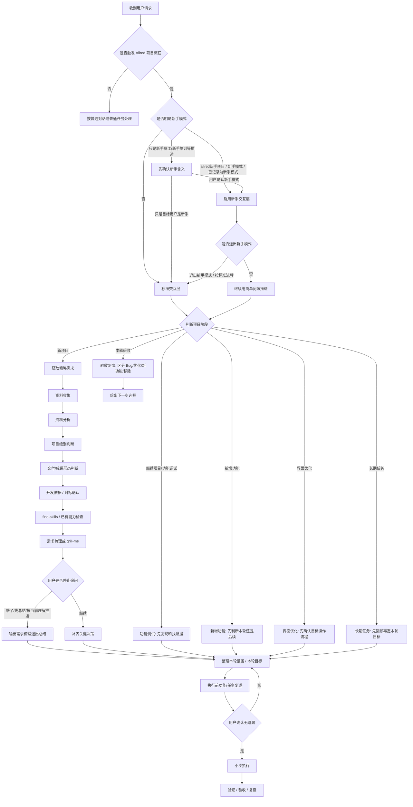

# Allred Project Standard Skill

`allred-project-standard` 是一个 Codex 项目推进标准流程 Skill，用于启动新项目、继续已有项目、长期技术任务、功能调试、新增功能、界面优化和本轮验收复盘。

它不只适合做 App 或小工具。对于关节臂测量机这类长期任务，可以把“本轮功能”理解为“本轮任务目标或验证目标”，把“交付形态”理解为“本轮成果形态”，例如分析结论、测试记录、验证报告、资料目录、阶段计划或可运行工具。

长期任务建议使用更明确的触发词：

```text
allred长期任务
继续长期任务
长期任务复盘
长期任务调试
长期任务资料分析
长期任务验证
```

如果只说“长期任务”且意图不明确，Codex 会先确认是进入长期任务模式，还是只讨论方法。

它的核心原则是：

```text
先限定方向；
再确认计划；
小步执行；
每步验证；
发现跑偏立即暂停纠偏。
```

## 1. 安装

```powershell
git clone https://github.com/pray5233/allred-project-standard.git
cd allred-project-standard
.\install.ps1
```

安装后，新开一个 Codex 对话再使用。

## 2. 推荐从新手模式开始

普通员工或第一次做项目时，推荐这样启动：

```text
allred新手项目
我想做一个 Excel 清单整理工具。
```

新手模式不会降低开发标准，只是降低沟通门槛：

- 一次只问一个问题。
- 优先使用编号选项，推荐项放在 `1`。
- 不先问代码、框架、数据库、部署。
- 优先让用户提供样例文件、截图、旧表格或流程说明。
- 后续调试、新增功能、界面优化、验收复盘也继续使用简单问法。

退出新手模式：

```text
退出新手模式
按标准流程继续
```

## 3. 新项目 / 长期任务的使用顺序

```text
allred新项目
我想做一个 Excel 清单整理工具，导入一个表格，输出整理后的汇总表。
```

新项目或长期任务建议按 **Allred 项目推进 14 步闭环** 推进：

```text
1. 粗略需求
-> 2. 资料收集
-> 3. 资料分析
-> 4. 项目级别判断
-> 5. 交付/成果形态判断
-> 6. 开发依据 / 对标确认
-> 7. find-skills / 已有能力检查
-> 8. 需求梳理
-> 9. 总功能/总目标和本轮范围拆分
-> 10. 执行前功能/任务复述
-> 11. 用户确认
-> 12. 小步执行
-> 13. 验证
-> 14. 验收复盘
```

| 阶段 | Codex 要做什么 | 用户要确认什么 | 产出 |
| --- | --- | --- | --- |
| 1. 粗略需求 | 先听用户描述，不急着写代码或直接执行 | 这个工具/任务大概要解决什么问题 | 初始需求描述 |
| 2. 资料收集 | 提醒用户加入样例文件、截图、旧表格、流程说明 | 是否已有可参考资料 | 资料清单 |
| 3. 资料分析 | 先看资料，从资料中提取字段、流程、异常情况 | Codex 对资料的理解是否正确 | 资料分析结论 |
| 4. 项目级别判断 | 判断是小项目、中型项目还是复杂项目 | 是否按这个级别推进 | 项目级别 |
| 5. 交付/成果形态判断 | 判断做成单 HTML、Excel 模板、桌面 App、网页、脚本、分析报告、资料目录还是阶段计划 | 使用者电脑能否运行，成果是否便于验收 | 交付/成果形态 |
| 6. 开发依据 / 对标确认 | 明确按什么参考来做 | 用户指定对标、公司经验、AI 初稿还是 Codex 查找 | 开发依据 |
| 7. find-skills / 已有能力检查 | 检查是否已有合适 Skill、插件、模板、脚本 | 是否调用或轻量复用 | 能力检查结果 |
| 8. 需求梳理 | 补齐目标、输入、输出、边界、规则、验收 | 关键业务规则是否准确 | 需求梳理结论 |
| 9. 总功能/总目标和本轮范围拆分 | 区分以后可能做什么、本轮只做什么 | 本轮范围是否合理 | 总功能/目标地图 / 本轮范围 |
| 10. 执行前功能/任务复述 | 用普通话复述本轮功能或任务 | 有没有遗漏、误解、多余内容 | 执行前确认清单 |
| 11. 用户确认 | 等用户确认再动手 | 是否开始开发或执行 | 明确确认 |
| 12. 小步执行 | 一次只做一小步，可能是开发、分析、整理、验证或复盘 | 每步是否符合目标 | 可验证的阶段结果 |
| 13. 验证 | 用样例文件、截图、输出结果、运行环境验证 | 是否达到验收标准 | 验证结果 |
| 14. 验收复盘 | 区分 Bug、优化、新功能、移除、待验证问题 | 下一步先修、优化、加功能、补资料、继续验证还是交接 | 验收复盘结论 |

关键闸门：

- 资料分析后再问。
- 确认依据后再设计。
- 检查已有能力后再决定是否调用专家 Skill。
- 复述功能/任务后再开发或执行。
- 验证通过后再交付。

长期任务示例：

```text
继续长期任务
这是关节臂测量机长期任务，本轮我想解决测量数据稳定性问题。
请按 Allred 项目流程帮我判断本轮目标、已有资料、验证方式和下一步。
```

本轮验收示例：

```text
长期任务复盘
关节臂测量机项目这轮已经完成日志整理和初步误差分析，请帮我复盘下一步。
```

长期任务每轮开始前建议先做回顾：

```text
1. 上轮已经确认什么
2. 上轮尚未验证什么
3. 当前最大问题是什么
4. 本轮只解决什么
5. 本轮怎样算完成
```

## 4. Skill 思考流程图



## 5. 停止追问

需求梳理过程中，如果问题已经够了，可以说：

```text
够了，先总结
```

或：

```text
停止追问，按当前理解推进
```

Codex 会停止继续追问，先输出当前理解和下一步选项，不会直接开发。

## 6. 继续已有项目

不要每次都重新开新项目。已有项目继续时使用：

```text
继续项目
导入后有几行没有识别。
```

常用阶段：

```text
功能调试
新增功能
界面优化
本轮验收
```

新手模式下，后续阶段也会继续用简单问法，例如先问截图、样例文件、实际结果和期望结果。

长期任务继续时，可以直接说明本轮目标：

```text
继续长期任务
这是关节臂测量机长期任务，本轮我想整理日志并判断测量误差是否稳定。
```

长期任务复盘时使用：

```text
长期任务复盘
本轮已经完成日志整理和初步误差分析，请区分已验证结论、未验证假设、遗留问题和下一轮建议。
```

## 7. 测试提示词

测试新项目：

```text
allred新项目
我想做一个 Excel 清单整理工具。
```

测试新手模式：

```text
allred新手项目
我想做一个 Excel 清单整理工具。
```

测试防误触发：

```text
allred新项目
我想做一份新手员工培训资料目录工具。
```

测试停止追问：

```text
够了，先总结，按当前理解推进。
```

测试长期任务：

```text
allred长期任务
这是关节臂测量机长期任务，目标是提升测量稳定性和问题定位效率。
```

## 8. 版本建议

稳定版本建议打 Git tag：

```text
v0.1.0
v0.2.0
```

测试反馈时请注明版本号或 commit id。
