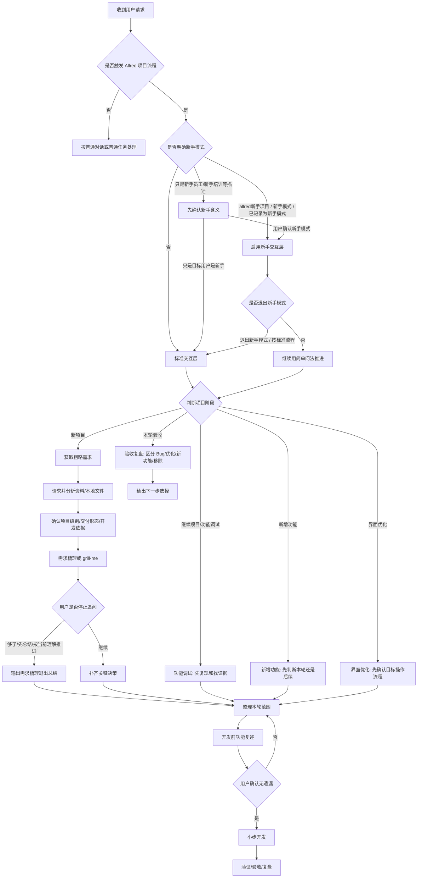

# Allred Project Standard Skill

`allred-project-standard` 是一个 Codex 项目开发流程 Skill，用于启动新项目、继续已有项目、功能调试、新增功能、界面优化和本轮验收复盘。

它的核心原则是：

```text
先限定方向；
再确认计划；
小步执行；
每步验证；
发现跑偏立即暂停纠偏。
```

## 1. 安装

```powershell
git clone https://github.com/pray5233/allred-project-standard.git
cd allred-project-standard
.\install.ps1
```

安装后，新开一个 Codex 对话再使用。

## 2. 推荐从新手模式开始

普通员工或第一次做项目时，推荐这样启动：

```text
allred新手项目
我想做一个 Excel 清单整理工具。
```

新手模式不会降低开发标准，只是降低沟通门槛：

- 一次只问一个问题。
- 优先使用编号选项，推荐项放在 `1`。
- 不先问代码、框架、数据库、部署。
- 优先让用户提供样例文件、截图、旧表格或流程说明。
- 后续调试、新增功能、界面优化、验收复盘也继续使用简单问法。

退出新手模式：

```text
退出新手模式
按标准流程继续
```

## 3. 新建项目的使用顺序

```text
allred新项目
我想做一个 Excel 清单整理工具，导入一个表格，输出整理后的汇总表。
```

Skill 会按顺序处理：

1. 先复述你的大概需求。
2. 提醒你加入样例文件、截图、旧表格或流程资料。
3. 先分析资料，再继续问问题。
4. 判断项目级别、使用者电脑环境和交付形态。
5. 梳理本轮功能、后续功能和明确不做的内容。
6. 在开发前复述功能需求，询问是否有遗漏。
7. 用户确认后才开始开发。
8. 完成后按验收方式检查结果。

## 4. Skill 思考流程图



## 5. 停止追问

需求梳理过程中，如果问题已经够了，可以说：

```text
够了，先总结
```

或：

```text
停止追问，按当前理解推进
```

Codex 会停止继续追问，先输出当前理解和下一步选项，不会直接开发。

## 6. 继续已有项目

不要每次都重新开新项目。已有项目继续时使用：

```text
继续项目
导入后有几行没有识别。
```

常用阶段：

```text
功能调试
新增功能
界面优化
本轮验收
```

新手模式下，后续阶段也会继续用简单问法，例如先问截图、样例文件、实际结果和期望结果。

## 7. 测试提示词

测试新项目：

```text
allred新项目
我想做一个 Excel 清单整理工具。
```

测试新手模式：

```text
allred新手项目
我想做一个 Excel 清单整理工具。
```

测试防误触发：

```text
allred新项目
我想做一份新手员工培训资料目录工具。
```

测试停止追问：

```text
够了，先总结，按当前理解推进。
```

## 8. 版本建议

稳定版本建议打 Git tag：

```text
v0.1.0
v0.2.0
```

测试反馈时请注明版本号或 commit id。
