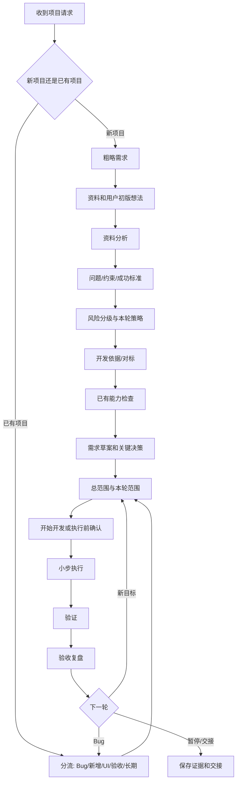

# Allred Project Standard Skill

`allred-project-standard` 是一个 Codex 项目推进 Skill。它帮助用户把粗略想法变成可验证的本轮工作，同时避免两个极端：

```text
连续追问太多 <- Allred -> 全程不交流、Codex 自己决定
```

它适用于 App、脚本、自动化、数据整理、文档/知识库、设备相关分析、长期技术任务，以及 Skill/工作流优化，不只适合新建软件。

核心原则：

```text
先限定方向；
再确认本轮；
小步执行；
证据验证；
验收复盘。
```

## 安装

```powershell
git clone https://github.com/pray5233/allred-project-standard.git
cd allred-project-standard
.\install.ps1
```

安装后新开一个 Codex 任务。

## 推荐入口

第一次做项目或不熟悉开发：

```text
allred新手项目
我想做一个 Excel 清单整理工具，主要给普通办公室员工使用。
```

标准新项目：

```text
allred新项目
我想做一个客户问题跟踪工具，已有历史表格和初步想法。
```

继续已有项目：

```text
继续项目
导入后有几行没有识别。
```

也可以直接使用阶段词：

```text
功能调试
新增功能
界面优化
本轮验收
```

长期任务：

```text
allred长期任务
这是一个长期数据稳定性分析任务，本轮想先整理最近日志并验证一个判断。
```

长期 Skill/流程优化：

```text
长期任务优化
扫描当前 Skill 的架构和内容，找出不合理的地方并重构。
```

## 新手模式

新手模式只改变沟通方式，不降低开发标准，也不代表项目一定简单。

它会：

- 使用普通业务语言，不先问框架、数据库或命令
- 优先接收样例文件、截图、旧模板和用户已有想法
- 把多个追问压缩成一张关键决策卡
- 给出推荐默认值，回复 `1` 可全部确认
- 假设使用者是普通办公电脑，但不会擅自决定交付形态
- 在较长检查和开发过程中说明正在查什么、为什么查
- 保留相同的验证、数据保护和写入边界

退出时说：

```text
退出新手模式，按标准流程继续。
```

项目和当前阶段会保留，不会重新开始。

## 项目流程

```text
1. 粗略需求
-> 2. 用户已有资料和初版想法
-> 3. 资料分析
-> 4. 问题、约束和成功标准
-> 5. 风险分级与本轮策略
-> 6. 开发依据/对标
-> 7. 已有能力检查
-> 8. 使用环境和交付形态（需要时）
-> 9. 需求草案和关键决策
-> 10. 总范围和本轮范围
-> 11. 开始开发/执行前确认
-> 12. 小步执行和验证
-> 13. 验收复盘
```

这些是 Codex 的思考和证据工作顺序，不是 13 轮提问。普通新项目默认只有三个用户可见节点：资料和初版想法、一次合并决策卡、一次醒目的开发前确认。对标搜索、能力检查、分级草案和技术预检由 Codex 内部完成并报告结果。

| 阶段 | Codex 做什么 | 用户主要确认什么 |
| --- | --- | --- |
| 粗略需求 | 理解要解决的问题，不先发明技术方案 | 目标和使用者是否理解正确 |
| 资料和初版想法 | 接收文件、链接、历史结果、人工流程和用户方案 | 哪些是已有依据 |
| 资料分析 | 从资料中提取事实、规则、异常和缺口 | 对资料的理解是否有关键错误 |
| 问题与成功标准 | 定义输入、输出、约束、非目标和可观察验收 | 怎样才算真正完成 |
| 分级与策略 | 根据数据、系统、风险、用户、维护和验证证据判断 | 一次做完、先验证一部分，还是先补证据 |
| 对标 | 优先本地和用户依据，再看官方，必要时才看外部 | 借鉴什么、哪些地方不能照搬 |
| 能力检查 | 检查已有 Skill、插件、MCP、脚本、库和模板 | 是否需要新增能力或依赖 |
| 环境与交付 | 判断普通文件、桌面 App、网页或脚本能否落地 | 使用者电脑能否真正运行 |
| 需求决策 | Codex 先内部推演，再只显示会改变结果的决策 | 范围、数据边界、交付、验收等关键选择 |
| 范围 | 区分总目标、本轮、后续保留和移除 | 本轮有没有遗漏或多做 |
| 执行前确认 | 明确还没开始，列出文件、命令、不触碰内容和验收 | 是否按该范围开始 |
| 执行与验证 | 在确认范围内持续推进和反馈，不反复请示 | 出现新方向或风险时再决策 |
| 验收复盘 | 区分 Bug、优化、新功能和未来任务 | 下一轮优先级 |

## 项目分级

Allred 不再让用户先凭感觉选择“小/中/复杂”。Codex 会根据证据判断：

- 工作流是否有多个相互影响的环节
- 是否处理原始、共享、生产数据或真实设备
- 核心规则、来源可信度和验收是否明确
- 是否依赖 API、登录、托管、打包、定时或硬件
- 是否多人、多部门、需要权限、审计或交接
- 出错是否影响交付、质量、安全、客户或最终结论
- 是否需要长期维护

项目复杂度和本轮策略分开判断。复杂项目可以先做一个小验证；需求清楚、风险低的中小项目也可以一轮实现全部明确功能。

## 对标与 find-skills

外部对标软件不是强制的，但非简单设计必须有明确开发依据。优先顺序：

```text
项目已有成熟实现/用户资料
-> 官方文档或维护良好的参考实现
-> 必要时再看优质外部产品或开源项目
-> 都不合适时才使用明确标注的 AI 假设
```

对标记录应说明来源和版本/日期、为什么可比、复用路径、明确差异和验收指标。

`find-skills` 不是固定仪式。只有出现真实能力缺口，或用户明确要求时才使用。已有可靠 Skill、脚本、库或项目模式时直接复用。

完整专家 Skill 也不是默认调用。用户明确点名时使用；否则优先复用其方法，只有额外工具、成本、权限或流程会影响用户时才询问。

用户没有指定对标时，Codex 会自动按照上述顺序寻找并记录依据，不会再询问“由我寻找参考、你指定参考、按 AI 初稿开发”。产品操作对标、真实数据来源和技术实现依据会分别记录，一个产品网页不能同时证明三者。

## 少问，但不能没有交流

普通任务通常使用一张包含 1-4 个相关决策的卡片。事实由 Codex 从资料和工程中检查，用户只决定会改变以下内容的事项：

- 项目范围和用户可见行为
- 真实数据还是模拟验证
- 数据来源可信度和隐私/权限
- 写入边界
- 交付形态
- 验收含义
- owner 和交接

同一时点已经能够确定的问题应合并呈现，不应连续逐个询问搜索方式、输出、更新频率、电脑环境和地区。新增一轮问题必须来自新证据、答案冲突，或者前一轮无法预见的阻塞项。

一张普通决策卡尽量只保留 1-4 个真正需要用户决定的事项。字段、状态、失败处理和验收规则较多时，Codex 会先整理为 `范围草案 V1`，再让用户一次批准或修改；卡片外的建议不会自动视为已经确认。

搜索对象和触发方式是两个不同决定。例如“按预设品牌清单搜索”可以与“手动点击更新”同时成立；后一个答案不能静默覆盖前一个答案。

期望“双击打开”只说明使用体验，不代表目标电脑允许安装、具有管理员权限或可以运行后台服务。安装权限、网络条件和本轮验证环境会作为不同维度放在同一张决策卡中，不使用相互重叠的电脑环境选项。

多决策时可这样回复：

```text
1
```

表示全部按推荐确认；修改某一项时使用：

```text
D2=只读取公开来源，D3=用3个真实样例验收
```

用户说“停止询问、够了先总结、问题太多”时，Codex 会停止连续追问，先给草案、假设和下一步。

用户说“前面的会话不参考”时，只清除历史假设，不会丢掉当前消息里的需求。

新手开场中的“暂无资料”只表示资料状态，不等于授权 Codex 先做小版本、使用模拟数据或自行定义功能。用户应同时提供自己的初步想法；没有想法时，Codex 会在后续合并决策卡中给出可选方向。

如果来源核对、对标或环境检查预计超过约一分钟，Codex 应先说明正在检查什么、服务于哪个已确认决策，并在约一分钟或关键节点给出进度，不能沉默数分钟后再一次性公布由 Codex 自己选定的功能和技术路线。

## 真实能力与模拟原型

对于自动搜索、公开信息监测、AI 摘要或报告生成项目，资料暂时没有整理好并不等于允许使用模拟数据代替真实目标。

Codex 应先让用户选择：

```text
1. 用少量真实/公开来源验证核心能力（推荐）。
2. 先做模拟数据界面，只验证操作流程。
3. 先整理来源和规则，暂不开发。
4. 只出方案，不开发。
```

模拟原型只能证明交互流程，不能证明真实信息能获取、可信或可长期维护。

选择 `1` 只表示确认“真实来源验证路线”，不表示允许 Codex 自动决定行业、主题、功能、数据接口、技术栈或交付方式。

如果用户只说“行业市场动态”或“某产品的市场信息”，但没有说明具体对象或信息类型，Codex 下一步应先使用一张最小验证定义卡：

```text
| 编号 | 需要确认 | 推荐默认 |
| --- | --- | --- |
| D1 | 具体行业/产品/品牌及信息类型 | 必须由用户填写，例如产品参数、新闻动态、渠道价格 |
| D2 | 语言与地区 | 中文展示，允许中英文公开来源，保留原文链接 |
| D3 | 首轮证明 | 手动触发一次，得到可追溯的真实结果列表 |
| D4 | 本轮运行边界 | 先在当前开发电脑验证，正式交付形态后续确认 |

回复示例：
D1=工业机器人，重点看新品和展会动态；其余按推荐
```

在 D1 没有确认前，不应该先查 API、扩展字段和功能、宣布项目最终级别、选择 React/Vite 或生成开发确认卡。

真实来源首轮通常只做一个窄闭环：一个用户指定主题、一至三个匹配来源和手动触发。具体字段、失败状态与输出格式必须先写入 `范围草案 V1` 由用户确认，不能因为它们很常见就自动进入本轮。自动刷新、收藏、复杂筛选、AI 摘要、历史数据库和完整移动端适配默认放到后续。

产品对标和数据来源验证必须分开：Feedly 一类产品可以参考操作流程，但不能证明某个新闻 API 覆盖目标行业；某个 API 返回一条结果，也不能证明市场监测覆盖充分。

在真实来源样本尚未验证前，不把“至少找到 20 条”等任意数量作为推荐验收标准。第一轮先验证相关性、原始链接可追溯、关键字段准确、失败状态可区分以及确认环境能够运行；数量指标必须来自用户要求或实际来源样本。

浏览器前端中的 API key 对使用者可见。公开测试 key 只能用于明确标注的可行性验证；正式交付需要用户自己的 key 管理方案、后端代理或无需密钥的公开来源。React/Vite 的 localhost 开发服务也只能先称为开发验证，不能直接称为普通员工可用的成品。

## 开始开发前确认

对新 App/工具、范围扩展、长期任务写入、依赖安装、打包、部署、共享数据或设备/系统操作，Codex 会显示醒目的确认卡：

```text
【开始开发前确认】
我还没有开始写代码。确认后才会按下面范围创建/修改文件和运行命令。
...
```

确认卡必须包含具体文件、命令、不触碰内容、回退和验收。未知时先做只读检查，不能写“待确认后列出”。

确认卡只能复述已经确认的功能。第一次出现在确认卡中的自动刷新、收藏、筛选、预设主题、AI 摘要、响应式适配等内容，不能因为用户回复 `1` 就自动进入本轮范围。

用户已经对同一张范围卡说“按照这个范围开始”后，Codex 不应再次重复确认。提交、推送、发布、部署、安装或设备写入等额外动作仍需明确授权。

## 验收与长期任务

验收会把已批准范围逐项对账，区分：

- 已验证：有明确测试、工具、文件、目标环境或人工证据
- 仍未验证：缺少哪项证据，以及阻塞技术验收、产品验收还是用户确认
- 本轮未承诺：不作为当前缺陷

`测试通过`、`构建通过`不能自动证明界面实际操作、Excel 实际打开、说明书可用或真实用户已经确认。只有证据完整时才会无条件关闭本轮。

长期任务默认先做轻量回顾。用户已经明确授权只读分析且没有新的解释冲突时，Codex 会直接继续，不再询问一次“是否继续”；共享结论、设备、系统或原始资料写入仍需单独授权。

## 思考流程图



## 本地验证

```powershell
pwsh -NoProfile -File .\allred-project-standard\scripts\check_skill_structure.ps1
pwsh -NoProfile -File .\allred-project-standard\scripts\check_behavior_suite.ps1
```

第二条命令只检查行为用例与模块覆盖是否完整，不能代替真实对话测试。

测试 Skill 触发和交互时建议使用独立的测试组和检查组：测试组只看 `tests/behavior-cases.test.json`，检查组再使用 `tests/behavior-cases.oracle.json` 审阅原始对话。不要把 Oracle、预期答案或旧缺陷提前提供给测试组。完整标准见 `allred-project-standard/references/Skill测试验收.md`。

稳定版本可使用 Git tag，例如 `v0.3.0`。提交、打 tag 和推送需单独执行。
